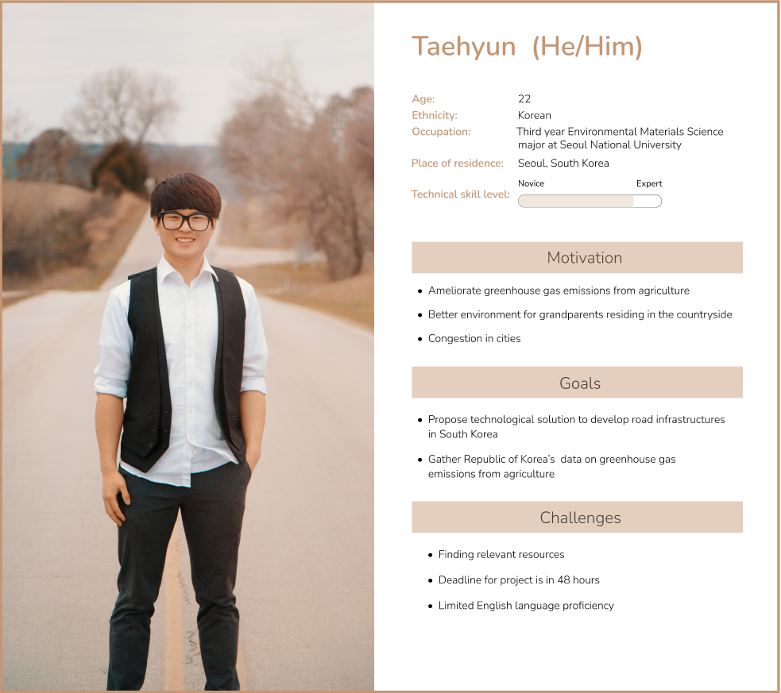
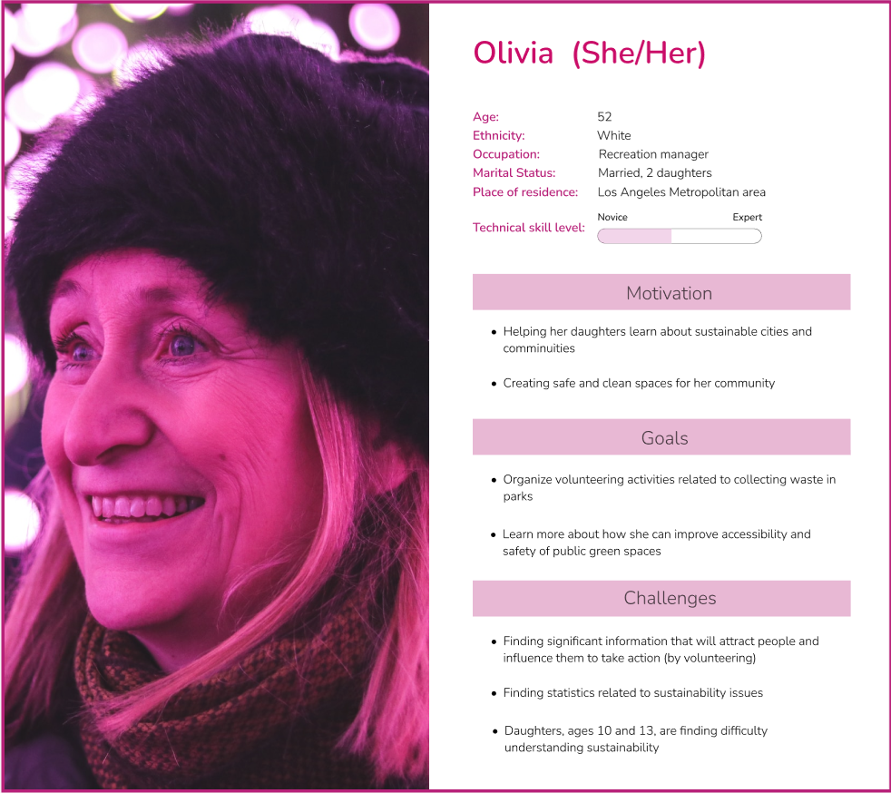

# DH110 Assignment4: Persona + Scenario
Cari Jung • DH110 • Fall 2022

## Purpose of UX Storytelling 

## Persona and Empathy Map
### Persona 1: Taehyun - College Student

#### Taehyun's Empathy Map

### Persona 2: Olivia - Recreation Manager

#### Olivia's Empathy Map

## Scenarios and Journey Map

